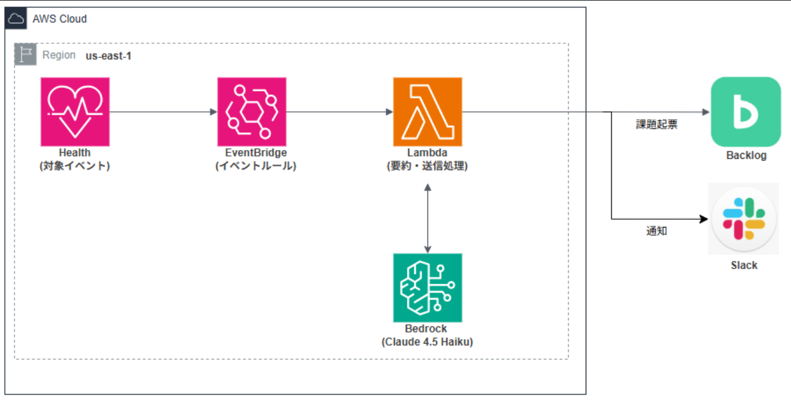

# AWS Health 自動通知システム

## 1. 概要
本プロジェクトは、AWS Health で発生した各種イベント（メンテナンス、障害情報等）を検知し、EventBridge および Lambda を介して Slack および Backlog へ自動通知する仕組みを AWS CDK を用いてコード化（IaC化）するものである。

手動構築された既存の通知検証環境をベースに、最小権限の IAM ポリシーや AWS Secrets Manager を用いた安全な Webhook URL / API キー管理を組み込んだ再利用可能なインフラストラクチャとして構築する。

---

## 2. システム構成
構成図および使用するメインサービスは以下の通りです。

1. **AWS Health**: イベントの発生源
2. **Amazon EventBridge**: AWS Health イベントを検知して Lambda を起動
3. **AWS Lambda**: イベント内容を受け取り, Bedrock 呼び出し＆通知処理を実行
4. **Amazon Bedrock(Claude 4.5 Haiku)**: 通知本文を「概要・緊急度・対応策」の3項目に日本語要約
5. **Backlog / Slack**: API 経由で課題を自動起票、または Webhook で通知

---

## 3. パッケージ・環境管理 (`uv`)

本プロジェクトでは、高速かつ厳密な依存関係管理を実現するため、Python パッケージ管理ツールとして **`uv`** を採用している。

### `uv` 採用の理由
* **高速な動作**: Rust 製であり、既存ツール（Poetry 等）と比較して依存解決およびパッケージインストールが非常に高速である。
* **環境の一元管理**: `pyproject.toml` および `uv.lock` により、決定論的で再現性の高い仮想環境構築が可能となる。
* **標準規格への準拠**: Python 標準規格である `pyproject.toml` を中心にプロジェクトを管理する。

### 基本コマンド

```bash
# 仮想環境のセットアップおよび依存関係の同期
uv sync

# パッケージの追加
uv add <package_name>

# CDK コマンドの実行 (cdk.json 経由で uv run が使用される)
cdk synth
cdk diff
cdk deploy
```